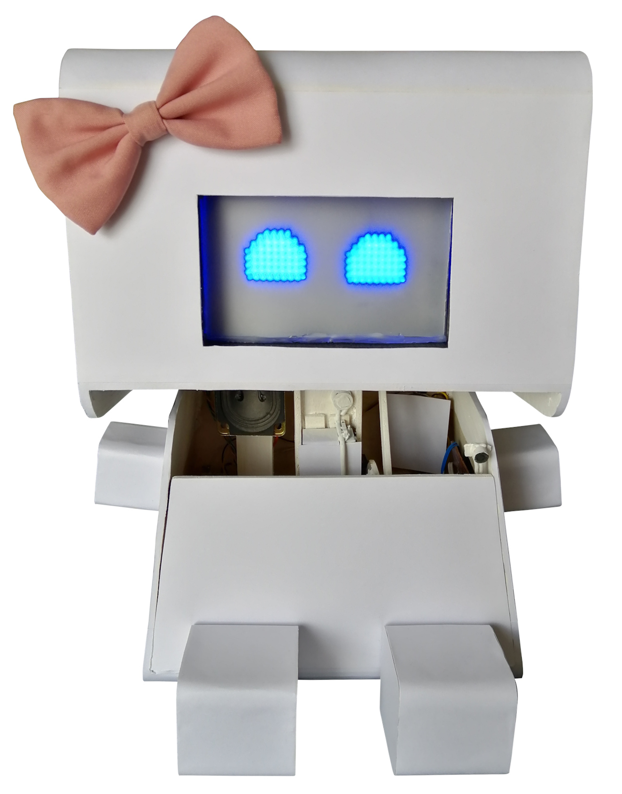

# Dors - the emotional robot

Named after *Dors Venabili*, a fictional character from Isaac Asimov's
"*Foundation*" series of novels.

This cutie talks with children and reacts by showing the emotions conveyed in
what the kid says, then analyses the overall emotional state of the whole
conversation for physiological evaluation purposes.

